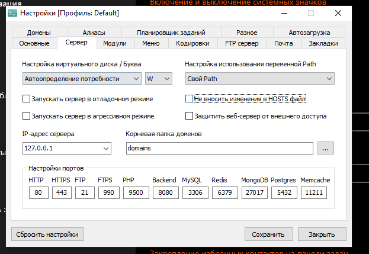
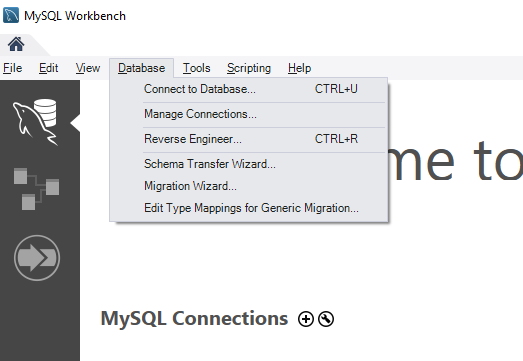
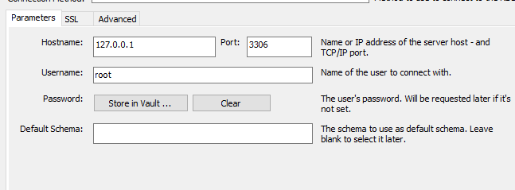
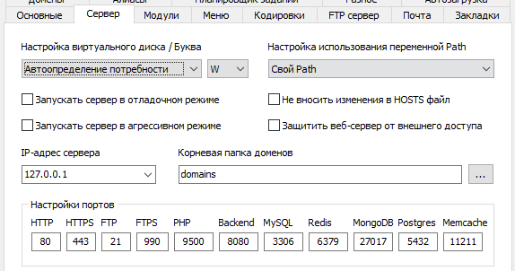
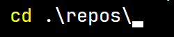
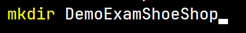
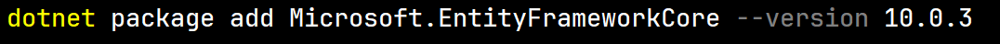
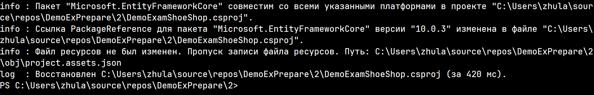
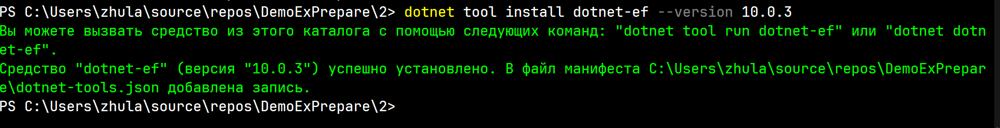

Начнем с БД.
1. Открываем OpenServer и MySqlWorkbench
2. Запускаем OpenServer.
2.1. Предварительно смотрим выбран ли нужный модуль (MySql 8.0)
2.2. Если возникает ошибка с невозможностью записи в hosts или подобное то следует открыть настройки openserver (справа снизу значек ) и включить данную галочку (Не вносить изменения в hosts) 
3. Подключение к БД (connect to database) .
3.1. Обращаем внимание на порт. во вкладке сервер в openserver и в подключении порт должен совпадать , 
Почти все команды будут отображены в консоли, а так же опишу как делать это без нее
1. Переходим в нужную дерективу  (Просто открываем нужную папку в проводнике)
2. Создаем папку с нужным названием и соответственно переходим в нее 
3. Создаем blazor проект 
4. Проверка работоспособности  (Почему dotnet watch? - Он отслеживает изменения и сразу отрисовывает изменения)
5. Подключение пакетов.
5.1. Обязательно смотрим версию dotnet для пакетов 
5.2. Устанавливаем пакеты указывая версию dotnet 
5.3. Обязательно проверяем результаты скачивания пакета. Результат обычно в конце  
5. Установка dotnet tools (dotnet-ef) 
