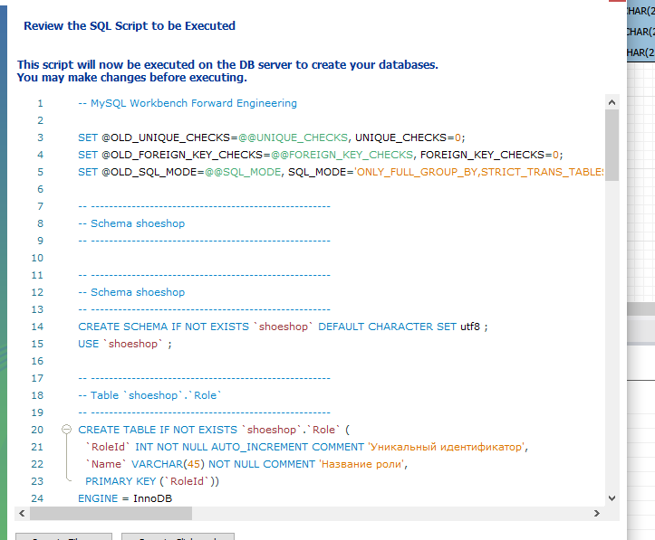
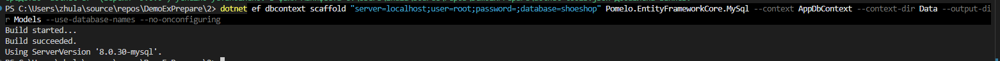
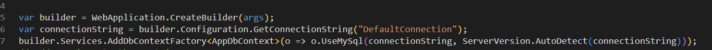
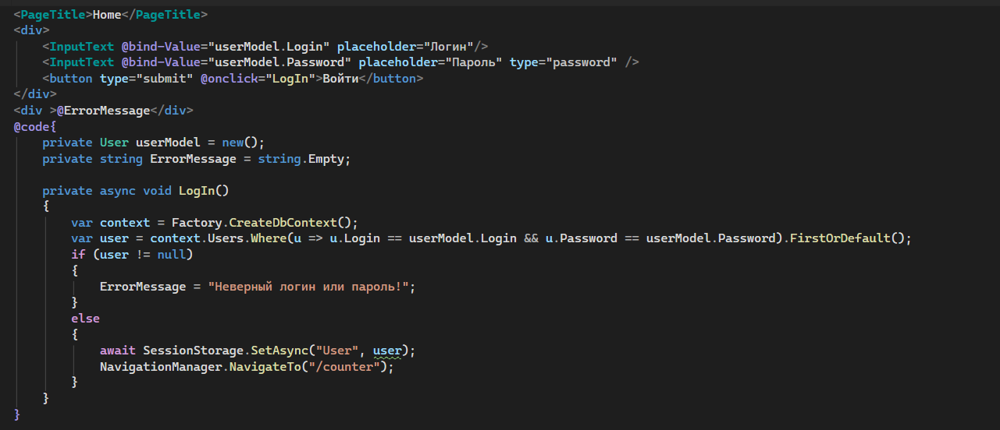

# Демонстрационный экзамен — Подготовка проекта

---

## Часть 1. База данных

### Шаги

1. **Открываем OpenServer и MySQL Workbench**

2. **Запускаем OpenServer**
   - Убедитесь, что выбран нужный модуль: `MySQL 8.0`
   - Если возникает ошибка с невозможностью записи в `hosts` — откройте настройки OpenServer (значок в трее) и включите галочку **«Не вносить изменения в hosts»**
   
   

3. **Подключение к БД** (Connect to Database)

   

   > Обратите внимание на порт: значение во вкладке **Сервер** в OpenServer и в настройках подключения должны совпадать.
   
    

4. **Разрабатываем схему БД**, прописываем комментарии к таблицам и полям.

5. **Переносим схему на сервер** через **Forward Engineer**.

6. Если по заданию нужно явно продемонстрировать создание таблиц SQL-командами — берём готовые скрипты, сгенерированные при создании.
   
   

7. Для экономии времени можно пропустить заполнение больших таблиц и ограничиться минимально необходимыми данными (например, роли пользователей).

---

## Часть 2. Blazor-проект

> Большинство команд выполняются в консоли, но ниже также описан способ без неё.

### Шаги

1. **Переходим в нужную директорию**
   
   
   *(Или просто открываем нужную папку в Проводнике)*

2. **Создаём папку проекта и переходим в неё**
   
   

3. **Создаём Blazor-проект**
   
   

4. **Проверяем работоспособность**

   ```bash
   dotnet watch
   ```

   > `dotnet watch` отслеживает изменения и автоматически перезагружает приложение.
   
   

5. **Подключаем пакеты**

   Сначала проверяем версию .NET:
   
   

   Устанавливаем пакеты, указывая нужную версию:

   ```bash
   dotnet add package Microsoft.EntityFrameworkCore --version <ваша_версия>
   dotnet add package Microsoft.EntityFrameworkCore.Design --version <ваша_версия>
   dotnet add package Pomelo.EntityFrameworkCore.MySql --version <ваша_версия>
   ```

   > Для `Pomelo` версия, как правило, оканчивается на `.0.0`, например `9.0.0`.

   

   > Обязательно проверяйте результат установки — он отображается в конце вывода.
   
   

6. **Устанавливаем dotnet-ef**

   ```bash
   dotnet tool install dotnet-ef --version <ваша_версия>
   ```

   

7. **Прописываем строку подключения** в `appsettings.json`

   ```json
   "ConnectionStrings": {
     "DefaultConnection": "Server=localhost;Port=3306;Database=<db_name>;User=root;Password=<password>;"
   }
   ```

8. **Генерируем модели из БД (scaffold)**

   ```bash
   dotnet ef dbcontext scaffold "server=localhost;user=root;password=;database=<db_name>" Pomelo.EntityFrameworkCore.MySql --context AppDbContext --context-dir Data --output-dir Models --use-database-names --no-onconfiguring
   ```

   


Работа с кодом
1. Регестрируем строку подлкючения и добавляем контекст .
2. Идем в домашнюю страницу [fdsf](/Components/Pages//Home.razor)
3. Регистрируем контекст (@inject IDbContextFactory<AppDbContext> Factory) предварительно подключив пространства имен Models, Data и Microsoft.EntityFrameworkCore
4. Прописываем минимальный код авторизации  
